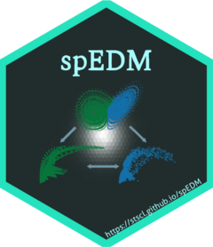

``` r
library(showtext)
showtext_auto(enable = TRUE)
font_add("ShineTypewriter", regular = "./ShineTypewriter-lgwzd.ttf")
library(hexSticker)
library(magick)

set.seed(42)

sticker(
  subplot = "./MCM.png",
  s_x = 0.995,
  s_y = 0.920,
  s_width = .6,
  s_height = .6,
  package = "spEDM",
  p_family = "ShineTypewriter",
  p_size = 18.5,
  p_x = 1.00,
  p_y = 1.525,
  p_color = "#a9fdff",
  dpi = 300,
  asp = 1,
  h_size = 2.25,
  h_color = "#24e2be",
  h_fill = "#212d2c",
  spotlight = TRUE,
  l_x = 0.955,
  l_y = 0.810,
  l_width = 4.25,
  l_height = 1.55,
  l_alpha = 0.95,
  white_around_sticker = F,
  url = "https://stscl.github.io/spEDM",
  u_color = "#a9fdff",
  u_size = 5.25,
  filename = "spEDM_logo.png"
)

image_read('./spEDM_logo.png') |> 
  image_resize("240x278")|> 
  image_write('./spEDM_logo.png')
```



**Special thanks to [my girlfriend](https://github.com/layeyo) for her
invaluable help to designing the central EDM figure.**
