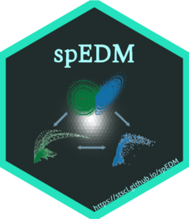

```{r setup, include = FALSE}
knitr::opts_chunk$set(echo = TRUE,
                      dpi = 300,
                      warning = FALSE,
                      message = FALSE,
                      out.width = "100%",
                      out.height = "100%",
                      fig.align = 'center',
                      comment = "##")
```

```r
library(ggplot2)
set.seed(123)
fig1 = ggplot(data.frame(x = rnorm(5e5),y = rnorm(5e5)), 
              aes(x = x, y = y)) +
  geom_hex(bins = 30, show.legend = F) +
  scale_fill_gradient(low = "#212d2c", high = "#ffffff") + 
  coord_fixed() + 
  theme_void() +
  theme(
    plot.background = element_rect(fill = "transparent", color = "transparent"),
    panel.background = element_rect(fill = "transparent", color = "transparent")
  ) +
  ggview::canvas(width = 600, height = 550, units = 'px')
ggview::save_ggplot(fig1,'./bg.png',dpi = 100, bg = 'transparent')

ccm = figpatch::fig('./CCM1.png')
ccm = ggimage::ggbackground(ccm, './bg.png')
  
ggplot2::ggsave("./ccm_binding.png", ccm,
                width = 3.25, height = 3.25, 
                dpi = 100)

library(showtext)
showtext_auto(enable = TRUE)
font_add("ShineTypewriter", regular = "./ShineTypewriter-lgwzd.ttf")
library(hexSticker)
library(magick)

sticker(
  subplot = "./ccm_binding.png",
  s_x = 0.995,
  s_y = 0.920,
  s_width = .6,
  s_height = .6,
  package = "spEDM",
  p_family = "ShineTypewriter",
  p_size = 18.5,
  p_x = 1.00,
  p_y = 1.525,
  p_color = "#a9fdff",
  dpi = 300,
  asp = 1,
  h_size = 2.55,
  h_color = "#24e2be",
  h_fill = "#212d2c",
  white_around_sticker = F,
  url = "https://stscl.github.io/spEDM",
  u_color = "#a9fdff",
  u_size = 5.25,
  filename = "spEDM_logo.png"
)

image_read('./spEDM_logo.png') |> 
  image_resize("256x256")|> 
  image_write('./spEDM_logo.png')
```



**I would like to extend my sincere gratitude to [my girlfriend](https://github.com/layeyo) for her invaluable assistance in designing the base EDM figure.**